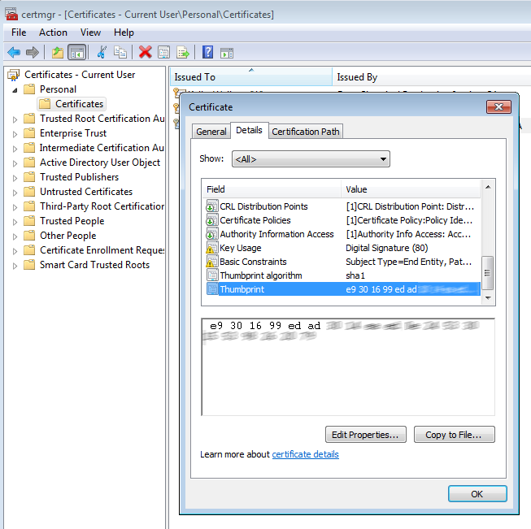

@{
    Layout = "post";
    Title = "MAGE.EXE and the Certificate Store";
    Date = "2015-04-08T09:16:36";
    Tags = "";
    Description = "";
}

I need to sign a ClickOnce manifest using `mage.exe`.
The certificate is in the Windows Certificate Store.
How do I do that?

<!--more-->

There are two things you need to know.

First, use mage.exe's `-CertHash` parameter instead of the `-CertFile` parameter.

Second, locate the certificate's hash.

* Open the `certmgr.msc` management console.
* Locate the certificate of interest.
* Double-click on it.
* Select the Details tab.
* Scroll down to the Thumbprint field and select it.
* Copy the Thumbprint onto the Windows clipboard.

Now, you can run `mage.exe` like this:

    mage.exe -Sign MyApp.application -ch "e9 30 16 99 ed ..."
    

